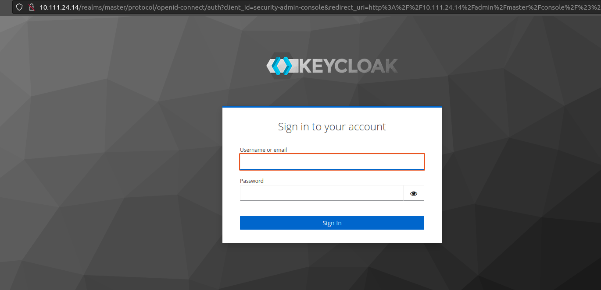

#Use  Custom Keycloak Docker Image and Deploying it on K8S

- Pull the docker Image 
`$ docker pull ghcr.io/adorsys/kcoid4vci:sha-e08e548`

- We create the file **"Keycloack.yaml"** and **"keycloak-ingress.yaml"** 

- We create the Keycloak deployment and service.
`$ kubectl create -f keycloak.yaml`

- We create an Ingress for Keycloak.
`$ kubectl create -f keycloak-ingress.yaml`
`$ minikube tunnel`
we can acces to the keycloack 

